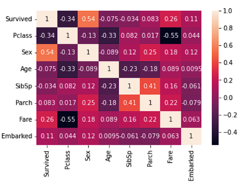
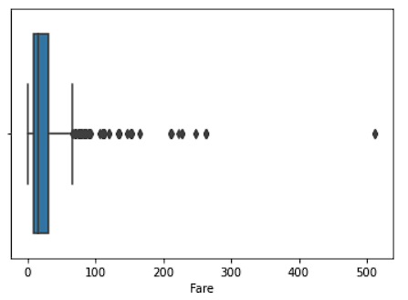
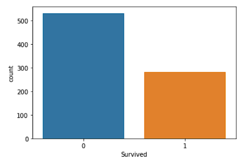

# Logistic-Regression

## Chapter 1: Introduction
This project focuses on using Logistic Regression to predict survival outcomes on the Titanic dataset. We begin by loading and preprocessing the dataset, followed by exploratory data analysis (EDA) to understand the data better. After feature selection and data splitting, we train a Logistic Regression model, make predictions, and evaluate its performance.

## Chapter 2: Dataset Overview
### 2.1 Dataset Description
The dataset used in this project is the Titanic dataset, which contains information about passengers on the Titanic, including their demographics, ticket class, and whether they survived or not. This dataset is commonly used in machine learning as a starting point for classification tasks.

### 2.2 Initial Data Load
We start by loading the Titanic dataset into a Pandas DataFrame. This allows us to preview the data and get an initial understanding of its structure.

## Chapter 3: Data Preprocessing and EDA
### 3.1 Data Preprocessing
**Mapping 'Sex' to Numerical Values**
We map the 'Sex' column to numerical values to convert it into a binary feature. 'Female' is mapped to 1, and 'Male' is mapped to 0. This transformation makes it suitable for logistic regression.

### 3.2 Exploratory Data Analysis (EDA)
**Correlation Heatmap**
We create a correlation heatmap to visualize the relationships between features. This heatmap provides insights into which features might be most relevant for predicting survival outcomes. \

We create a boxplot to detect the minimum, maximum, median and mean of the ages of the passengers. Boxplots are also helpful in observing any potential outliers. \

We then create a barplot to analyse the count of the male versus female passengers who sailed the RMS Titanic. \

**Feature Selection**
After observing the correlation heatmap, we decide to drop columns that are less likely to be predictive. We remove 'Name', 'Siblings/Spouses Aboard', 'Parents/Children Aboard', and 'Fare' from the dataset.

## Chapter 4: Model Preparation
### 4.1 Feature and Target Variable Selection
We select the features ('Pclass', 'Sex', 'Age') that we believe are relevant for predicting survival outcomes. The 'Survived' column is chosen as the target variable.

### 4.2 Data Splitting
To evaluate the model's performance, we split the dataset into training and testing sets. We allocate 80% of the data for training and 20% for testing.

## Chapter 5: Logistic Regression Modeling
### 5.1 Introduction to Logistic Regression
Logistic Regression is a classification algorithm used for binary and multi-class classification problems. It models the probability that a given input belongs to a particular class.

### 5.2 Model Training
We build a Logistic Regression model using scikit-learn and train it with the training data.

## Chapter 6: Model Evaluation and Prediction
### 6.1 Model Predictions
We make predictions using the trained Logistic Regression model on both the test and training sets.

### 6.2 Model Interpretation
**Intercept and Coefficients**
We examine the model's intercept and coefficients. These values help us understand how each feature contributes to the prediction. The logistic regression model uses a logistic function to model the probability of survival: \

*log(p / (1-p)) = b0 + (b1xPclass) + (b2xSex) + (b3xAge)* \
Here, 'b0' is the intercept, and 'b1', 'b2', and 'b3' are the coefficients associated with 'Pclass,' 'Sex,' and 'Age,' respectively.

### 6.3 Survival Prediction for a Specific Example
We demonstrate how to make a survival prediction for a specific example by providing values for 'Pclass,' 'Sex,' and 'Age.' Based on the logistic regression model, we determine whether the hypothetical passenger would have survived or not.

## Chapter 7: Model Evaluation
### 7.1 Accuracy and Confusion Matrix
We evaluate the model's performance using two key metrics:

**Accuracy**
Accuracy measures how many predictions the model got correct.It is calculated by dividing the number of correct predictions by the total number of predictions. \
**Accuracy: 0.7836734693877551**
**Confusion Matrix**
The confusion matrix provides a detailed view of model performance, showing the number of true positives, true negatives, false positives, and false negatives. \
**Confusion Matrix:**

| - | Did not survive | Survived |
| --- | --- | --- |
| Did not survive | 138 | 21 |
| Survived | 32 | 54 |

In this project, we used Logistic Regression to predict survival outcomes on the Titanic dataset. We demonstrated data preprocessing, exploratory data analysis, model training, and evaluation. The project showcases the application of logistic regression for binary classification tasks and how to interpret the model's coefficients and make predictions based on the model's output.
